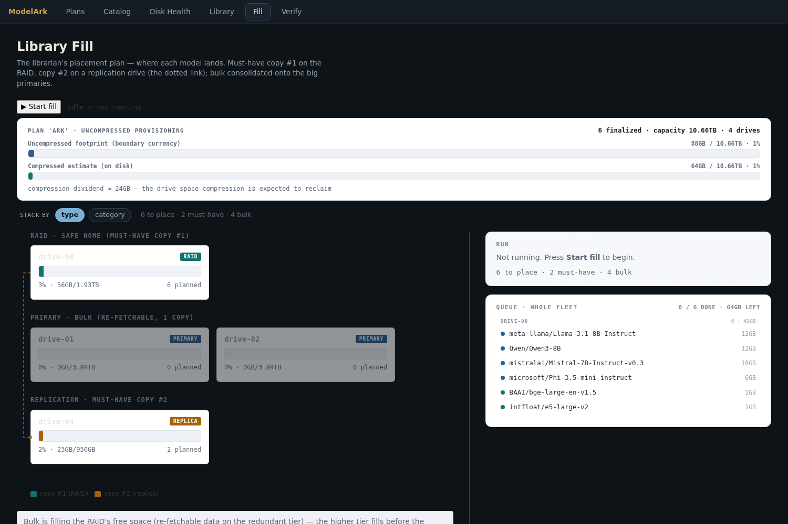

# ModelArk

> 🚧 **Building in public.** An in-progress project, developed openly (with Claude). It works
> end-to-end and its write-time restore canary is production-verified — but it isn't 1.0. The honest
> [Status](#status) + gaps are at the bottom; feedback and contributions are welcome.

An ark for open model weights: catalog every open model worth
knowing about, archive the ones worth keeping across an offline drive library —
**compressed and integrity-proven at write time** — and re-check the physical archive copies,
even for giants you cannot load locally.

## Why

Hugging Face has north of a million repos — really, have you checked lately? Most you'll
never keep. ModelArk catalogs the metadata broadly (cheap — a few MB), then downloads only
the curated, full-precision weights you find are worth archiving, tracked by **git-annex** across a fleet
of external HDDs + network attached storage (iSCSI). The git repo is the *map* of the library;
the bytes never touch git.

## Why else?

You could just use the Hugging Face tooling, keep it all local, and move it around afterward.
ModelArk is for when you'd rather **store now, use later**: version your library over time, and
let it spread downloads across whatever drives you have — efficiently, instead of by hand.

## Is that it?

Not even close. Weights are stored **ZipNN-compressed** (lossless, float-aware) for real
savings, and it **streams** — a giant shard compresses and restores in O(chunk) memory
(hundreds of MB), never fully materialized in RAM. On top of that:

- **Integrity you can trust** — every compression passes a round-trip *canary* (decompress →
  hash → match HF's sha256) *before* the original is dropped, so a model can't be archived in an
  unrestorable state.
- **Drive-health monitoring** — SMART vetting before a volume ever holds archives.
- **Plans** — multiple archive sets, each with its own drive fleet and budget.
- **Smart resume** — a crash re-processes only the interrupted shard; no re-download.
- **Tiered storage** — mark keepers *must-have* (kept redundantly) vs bulk that's cheap to re-fetch.
- **N-copies redundancy** — copy counts enforced from a durable record, not guessed.

…and there's plenty more in the [decision log](docs/decision_log.md). The product is **early**,
put out deliberately in a build-in-public stance — [contributions welcome](contributing/contributions.md).

## Honest callouts

This is pre-1.0 and built in public, so a few sharp edges are worth knowing before you point it at real drives.

**Downloading giants.** Hugging Face's `hf_xet` transport isn't byte-range resumable, so if a shard stalls or the process is killed mid-download, that shard restarts from zero — painful on a 30 GB shard of a larger model. A watchdog kills genuinely-hung transfers and a sweep clears the orphaned partials, so nothing corrupts and disk never leaks — but you re-spend the bandwidth. Tensor-level checkpointing is on the roadmap; for now, big models just want a stable connection for however long it takes to grab one shard.

**Compression isn't guaranteed per shard.** Every compression is proven by a round-trip canary before the original is dropped, so you can never end up with an unrestorable archive. But if some rare shard format or other unexpected input trips a bug in ZipNN or our handling of it (which has happened, and been patched, already), the shard gets stored *raw* instead. This is the correct and deliberate fallback: the file is intact and verified. However, it misses the (~⅓) savings — and recompute at model boundaries by the Librarian can start to push you past estimates. We show you both an uncompressed and an "optimally compressed" fill indication, but depending on how optimistically you target your own fleet, this behavior can throw the end of the downloads off the final drive in your Library — and you'll be unable to complete the archive. This is all logged; in the meantime we recommend being as un-optimistic on compression as you can — use the fully uncompressed value to budget wherever possible. "Rebase Existing Plan" (fill the gaps left by better-than-assumed compression rates) will come later. Note that rates are only strong on BF16; FP8 does not compress at all.

**Hardware honesty.** SMART read through some USB-to-SATA bridges is synthetic, so take health readings on bridged drives with a grain of salt (during testing here, a genuinely-failing drive passed its synthetic check and then got crushed on the first load). A NAS iSCSI LUN won't auto-reattach after a reboot: that's deliberate — we won't couple boot to a network mount and risk a boot hang — so re-login is manual. And the fill is a single worker that asks for drives in sequence, so expect to hot-swap externals during a large run rather than mounting the whole fleet at once. More automation here is needed, and planned.

**Smaller things.** The `zstd` fallback is optional; install the `zstd` extra if you disable
StreamZNN and want that fallback instead of raw storage. DuckDB support is isolated to the optional
`migration` extra for one-time legacy-catalog conversion. Tier B (functional,
generate-a-token) is not implemented. Tier A proves the complete declared safetensors layout, but
only fixed-header sanity for GGUF; neither format check reads or hashes tensor data. In the shipped
catalog export, `downloads_all` is empty, so `downloads_30d` is the available popularity field. More
advanced catalog and metadata work is also required, known, and planned.

**Be considerate.** ModelArk ships with a **1 TB/day** download cap (`download.max_24h_gb`; raise it — or set `0` to uncap — only if you must). This is an **archive/DR library-management** system, *not* a way to mirror large amounts of Hugging Face: point it at giant swaths of the Hub and you'll be rate-limited by them. The portal also warns you when a build set exceeds the daily cap. Please archive what you'll actually keep.

## Architecture

```
GitHub: Auspex-Aerie/modelark              ← code + sanitized catalog export
Local modelark-library git-annex repo      ← the private byte/location map
Tiered drive fleet (git-annex remotes)      ← the actual TBs of weights
   NAS RAID (iSCSI, copy #1) · big USB primaries (bulk) · a small replica drive (copy #2)
```

- **Catalog** — SQLite (by default `$XDG_DATA_HOME/modelark/catalog.sqlite`, rebuildable).
  Source of truth for *what exists* and *what we want*. Diffable, sanitized JSONL exports can be
  versioned separately from private drive and annex metadata.
- **git-annex** — authority for *where bytes physically live*; tracks drives even
  unplugged, enforces N-copies redundancy, `fsck`s integrity.
- **modelark.core** — reusable catalog/db primitives.
- **modelark** — discovery, placement (the "librarian"), fetch, compression, verify.
- **modelark.streamznn** — standalone MIT streaming-compression module (see below).

## The pipeline

`discover → curate → plan → fill → verify → replicate → restore`, with resumable archive work:

1. **Discover** metadata for the wishlist orgs (architecture-first classification, not HF's
   unreliable pipeline tags).
2. **Curate** in the portal — build a set within a size budget; mark keepers *must-have*.
3. **Plan** — the librarian bin-packs the set across the tiered fleet (must-have copy #1 on
   the RAID, bulk consolidated onto the big primaries, must-have copy #2 on a replica drive).
4. **Fill** — per shard: HF download → sha256 vs HF's canonical hash → compress → **canary**
   → drop the original → git-annex add → record. Throttled by a rolling 24 h cap (1 TB/day by default;
   `0` disables it), resumable at
   the file level (a crash re-processes only the interrupted shard, no re-download).
5. **Replicate** — must-have copy #2 is a *local* clone→clone transfer from copy #1 (no second
   HF download).
6. **Restore** — retrieve a readable annex copy, reconstruct the original Hugging Face paths,
   decompress into a hidden staging tree, verify every canonical sha256, then publish atomically.

## Compression & integrity

Weights are stored **ZipNN**-compressed (`.znn`, lossless, float-aware) and decompressed on
use. Every compression is gated by a mandatory **round-trip canary**: decompress the `.znn`,
hash the result, and require it equal HF's canonical sha256 **before** the uncompressed
original is ever deleted. A model can never be archived in an unrestorable state.

**StreamZNN** (`modelark/streamznn.py`, MIT, standalone) wraps ZipNN so a shard of *any* size
compresses and restores in **O(chunk) memory** — a 10 GB shard peaks ~800 MB instead of the
~26 GB that whole-file compression needs (which OOM-killed the portal once; see `INC-003`).
It frames independent, self-describing ZipNN blobs; writes are atomic; corruption fails loud;
and the canary shares the exact restore decompress path, so "canary passed" *means* "restore
is byte-identical." Proven in production: every archived file independently re-decompresses to
HF's canonical hash (`DIS-002`), including the four ~8 GB shards of the model that OOM'd.

**Codec gate** (`DEC-022`) — the codec is chosen *per shard* from config, so the new streaming
path isn't used unless it's warranted:

| condition | codec | why |
|---|---|---|
| `~4× shard ≤ max_compress_ram` | whole-file ZipNN | fastest, best ratio, in-RAM |
| over budget, `stream_compress: true` | **StreamZNN** | O(chunk), float-aware |
| over budget, stream off, `zstandard` installed | zstd-stream | boring/proven fallback |
| over budget, stream off, no zstd | raw | never compress what we can't do safely |

Restore/canary route by the stored file's magic, so every codec (and legacy `.znn`) restores.

`modelark restore --repo org/model --dest ./recovered` is the first-class recovery path. It tries
recorded copies in order, asks git-annex to retrieve dropped content, falls back to another replica
when a copy is offline or corrupt, and creates `./recovered/org/model` only after every planned file
passes its canonical hash. It refuses to overwrite an existing model tree.

## The portal

`modelark serve` → http://127.0.0.1:8077

The operator portal is loopback-only. Every request validates the loopback Host and port; mutations
also require exact same-origin requests, JSON bodies below 64 KiB, and a per-process CSRF capability.
Remote/operator text rendered into structured views is centrally HTML-escaped, and responses carry
a restrictive Content Security Policy. There is intentionally no non-loopback mode until
authentication exists.

- **Plans** — create or recall an archive set (its own drive fleet, budget, and provisioning mode);
  you pick an active plan per session before the other tabs unlock.
- **Catalog** — browse/curate the set within a size budget; filters, bulk select, finalize.
- **Disk Health** — SMART for attached drives (vet a volume before it holds archives).
- **Library** — what's actually archived and where, from the durable record (works offline).
- **Fill** — the librarian's placement plan as a live run surface: **Start/Stop**, a "now
  fetching" panel (per-shard phase, throughput, ZipNN ratio, 24 h-cap gauge), a queue, and
  per-drive fill bars. The fill runs in a single safe background worker inside the portal
  (one at a time, clean stop at a file boundary, dies with the process, per-file transactional).
- **Verify** — re-check archived copies on demand (record consistency + a decompress canary when the
  drive is mounted), and auto-surface anything that looks disrupted: a raw-fallback, a partial copy,
  or an archive written near a recorded interruption.



## Configuration — `wishlist.yaml`

Curation (what to collect) plus operational knobs. ModelArk loads an explicit `--config` first,
then `$XDG_CONFIG_HOME/modelark/wishlist.yaml`, then a checkout-root `wishlist.yaml` for editable
installs, and finally the packaged default:

```yaml
scope:               # architecture-derived categories included by `discover --walk`
  include_categories: [generative-llm, encoder, seq2seq]
always_include:      # orgs walked by `discover --walk`
  orgs: [deepseek-ai, Qwen]
exclude:
  pickle_only: true  # block pickle-only acquisition; false stores inert raw bytes

compression:            # DEC-022 codec gate
  max_compress_ram_gb: 4.0   # whole-file peak ≈ 4× shard; over this, don't use whole-file
  stream_compress: true      # over budget → StreamZNN; false → zstd-stream if installed, else raw
  threads: 1                 # ZipNN internal threads (was 4; its native threaded path can double-free — INC-005)
```

Must-have status (a replicated 2nd copy) is set with `modelark protect --repo <id>` (there is
no cart UI for it yet — see gaps below).

## Setup

**Python (3.10+):**
```bash
python3 -m venv .venv
.venv/bin/pip install -e .
```
`zipnn` is a hard dependency (compression + the canary). Optional capabilities are explicit extras:

```bash
.venv/bin/pip install -e ".[zstd]"       # stream-off zstd fallback
.venv/bin/pip install -e ".[migration]"  # one-time DuckDB → SQLite conversion
```

Without the `zstd` extra, the stream-off fallback stores raw. Normal installs do not pull DuckDB,
Torch, CUDA, or a workstation-specific dependency freeze.

For development, use a separate environment with the declared tooling extra:
```bash
python3 -m venv .venv-dev
.venv-dev/bin/pip install -e ".[dev]"
.venv-dev/bin/playwright install chromium
```

Writable state is never placed in the installed package. The catalog defaults to
`$XDG_DATA_HOME/modelark` (normally `~/.local/share/modelark`) and logs/state to
`$XDG_STATE_HOME/modelark` (normally `~/.local/state/modelark`). Use global options
`--data-dir`, `--state-dir`, and `--config` to override them. An existing checkout-local
`catalog/catalog.sqlite` is not moved automatically: start with
`modelark --data-dir ./catalog ...` until you deliberately migrate it.

**System packages (apt):**
```bash
sudo apt-get install -y git-annex smartmontools open-iscsi   # open-iscsi only if using a NAS LUN
```
- **git-annex** — tracks model bytes across the offline fleet.
- **smartmontools** — `smartctl`, for the Disk Health page.
- **open-iscsi** — attach a NAS RAID LUN as copy-#1 storage (optional).

**Disk Health SMART access — grant `smartctl` passwordless sudo (do NOT run the portal as root):**
The portal runs as *your* user (the shipped systemd unit sets `User=` to you, not root) so the catalog and the
git-annex clones on each drive stay user-owned. `smartctl` needs root, so grant it a single
passwordless-sudo rule rather than escalating the whole service:
```bash
echo "$USER ALL=(root) NOPASSWD: /usr/sbin/smartctl" | sudo tee /etc/sudoers.d/modelark-smartctl
sudo chmod 440 /etc/sudoers.d/modelark-smartctl
```
`disk_api` already calls `sudo -n smartctl`, so the Disk Health tab populates immediately — no portal
restart. **Don't run the portal as root:** root-owned catalog/annex files trigger git "dubious
ownership" refusals and it's a needless privilege escalation for a network-listening service. Only the
hardware ops (SMART read, `mkfs`, `mount`) are elevated, and only via `sudo`. *(Automating this
drop-in + the systemd unit is `DEF-025`.)*

**Hugging Face auth** (optional — gated repos, higher rate limits): `.venv/bin/hf auth login`.

## Usage

```bash
modelark discover --walk                     # catalog the wishlist orgs
modelark verify --all                        # Tier A remote-header evidence (no full download)
modelark protect --repo org/model            # mark must-have (numcopies=2 → a 2nd copy)
modelark serve                               # portal → :8077 (curate, then Fill)
modelark library plan                        # review the placement plan
modelark library plan --apply                # run the fill from the CLI (stop the portal worker first)
modelark restore --repo org/model --dest ./recovered  # verified restore to ./recovered/org/model
modelark export                              # dump JSONL for git
```
The fill runs either from the **Fill tab's Start button** (worker inside the running portal) or
from `library plan --apply`. SQLite/WAL allows concurrent readers, but do not run two independent
fill controllers against the same plan; stop the portal worker before starting the CLI fill.
Disk Health needs SMART access — grant passwordless sudo for `smartctl` (see **Setup**); don't run
the portal as root.

## Verification tiers

| Tier | Proves | Cost |
|------|--------|------|
| **A — Remote-header evidence** | safetensors: valid dtype/shape byte lengths, exact non-overlapping data layout, and complete shard-index mapping; GGUF: fixed-header sanity and a standard split filename sequence only | range-reads headers only — **works on a 700B without downloading it** |
| **B — Functional** | planned, not implemented | would require loading a model and exercising inference |

Archive integrity comes from the write-time sha256/canary and from re-verifying mounted physical
copies. Tier A does not read tensor data, prove architecture/loadability, or perform a security scan.
Pickle-only acquisition is blocked by default at archive planning; an explicit
`exclude.pickle_only: false` stores those files as inert raw bytes, which ModelArk never imports or
executes. Opcode scanning and Hugging Face scan integration are not implemented.

## Safety invariants (the gates)

- **Canary before drop** (`DEC-003`) — the uncompressed original is deleted only after the
  `.znn` is proven to decompress back to HF's exact bytes.
- **No silent under-replication** (`DEC-019`) — a must-have never ends below its copy count:
  GATE-A (every fetch target must be a live mount), GATE-B (refuse an unplaceable plan),
  GATE-C (post-fill assertion that every must-have holds ≥ numcopies complete copies).
- **Codec gate** (`DEC-022`) — streaming/zstd/raw chosen by an explicit RAM budget, logged per shard.
- **Crash-resume** — per-file transactional writes; a portal death loses at most the in-flight
  shard, which resume re-processes from the on-disk cache (no HF re-download).

Every architecture/policy decision, deferral, and incident is in
[`docs/decision_log.md`](docs/decision_log.md) (ADRLight-style ledger).

## Status

**Working + proven end-to-end:** catalog (~4.1k models) + Tier A remote-header evidence +
architecture-first classification; the librarian placement plan; the full fetch pipeline
(download → verify → ZipNN + canary → git-annex → record); StreamZNN streaming (no OOM on
10 GB shards); the codec gate; must-have 2-copy replication; verified atomic restore; crash-resume; first-class Plans
(per-set drive fleet + a capacity failsafe) + on-demand re-verification; and the portal's six
views including the live Fill run surface. Restorability is production-verified (`DIS-002`).

Tested here on a mix of reliable and junk external drives, plus one iSCSI volume on a RAID5 NAS
(Synology DiskStation). The iterative bug fixes and breaks along the way are in the decision log and
commit history. Branch protection and PR checks are active; the public history begins with the
sanitized repository snapshot and will grow from there.

For now: use it to archive, and use it carefully. We've built in tools to help you spot where problems
may have occurred and to give you options to fix them. Bad drives can and will fail after an extended
load (many hours of downloading weights), and there are likely a few gotchas in here we haven't run into
ourselves during testing.

The project will also move quickly at this alpha stage. We'll make sure everything migrates cleanly and
back up the existing DB before changes — but bear that in mind before making major local changes, since
merges may get harder. Instead, I'd suggest (and welcome!) offering changes as fork PRs — I'll review and
apply them quickly.

## Planned Roadmap

The [decision log](docs/decision_log.md) has the full picture; the headline deferrals:

- **Curation & safety** — a must-have toggle in the cart (CLI-only today), first-class gated/license-accept model handling, and deeper pickle hygiene (opcode scanning, quarantine, safetensors conversion).
- **Placement** — letting one model's shards span drives when it won't fit whole, compression-*aware* predictive packing (today it's a capacity failsafe), and growing or rebalancing a plan's fleet mid-run.
- **Fill & transport** — tensor-level download checkpointing so a giant shard resumes instead of restarting, plus in-flight queue edits (append / re-download / re-verify) during a run.
- **Verification & visibility** — a scheduled fleet-wide audit (on-demand re-verification already exists) and a download-status view over recorded `fetch_events`.
- **Recovery enhancements** — richer progress for multi-model restores, explicit conflict policies,
  and restore manifests. The safe repeatable-`--repo` verified workflow exists today.
- **Ops & packaging** — scripting host setup (the `smartctl` sudoers rule + systemd unit are manual) and spinning StreamZNN out into its own MIT repo.

## Unscheduled Roadmap

Pending more real-world usage data:

- Automated response to SMART changes / USB quirks — a helper that walks you through it.
- General onboarding and setup automation.
- Rebase / replan / move.
- Enhanced Verify — richer manual and automatic detection, and more features.
- Continued work on the Library view.
- UI-driven initial drive registration and setup — a guided terminal flow first, eventually a full UI setup and drive registration.

Contributions to any of these are welcome — see [contributing/](contributing/contributions.md).

## Licensing

ModelArk is licensed under [Apache-2.0](LICENSE). The standalone
[`modelark/streamznn.py`](modelark/streamznn.py) module retains its embedded MIT license. The
sanitized catalog export has additional provenance and third-party-rights notes in
[`catalog/export/README.md`](catalog/export/README.md); no model weights are distributed in this
repository.
